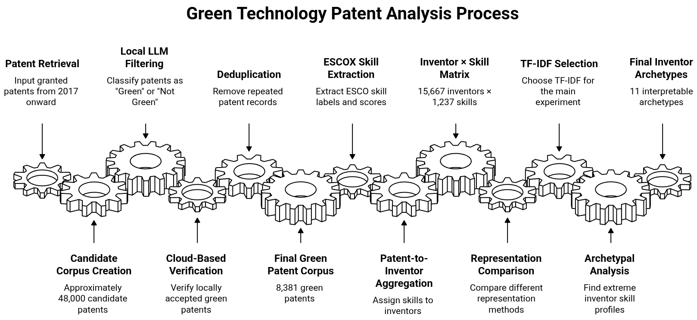
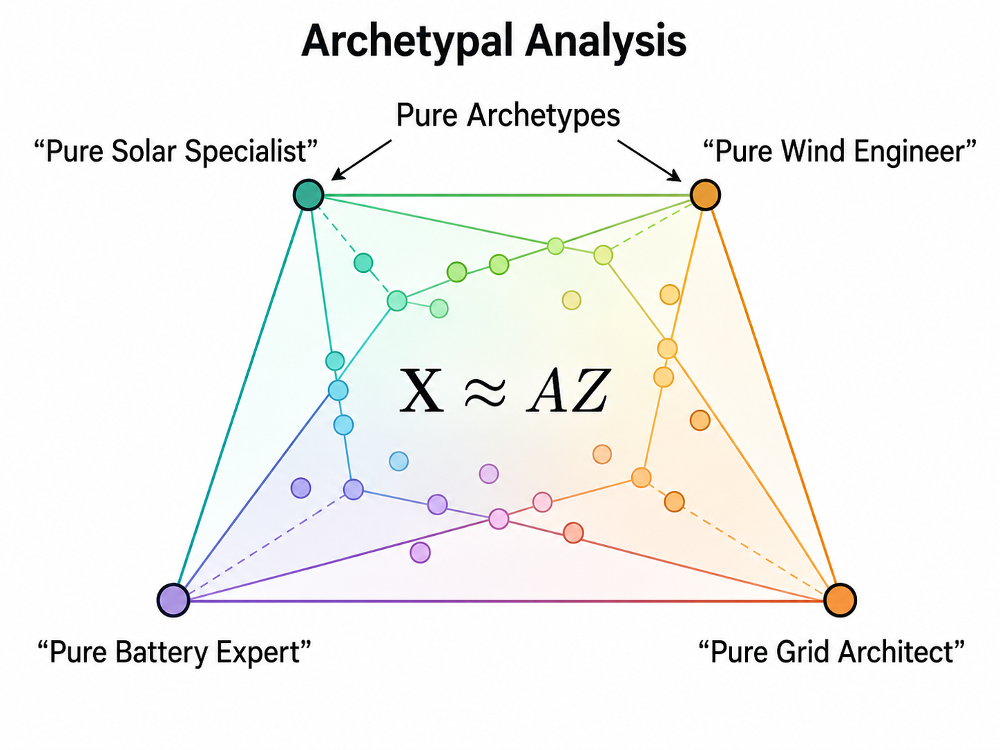
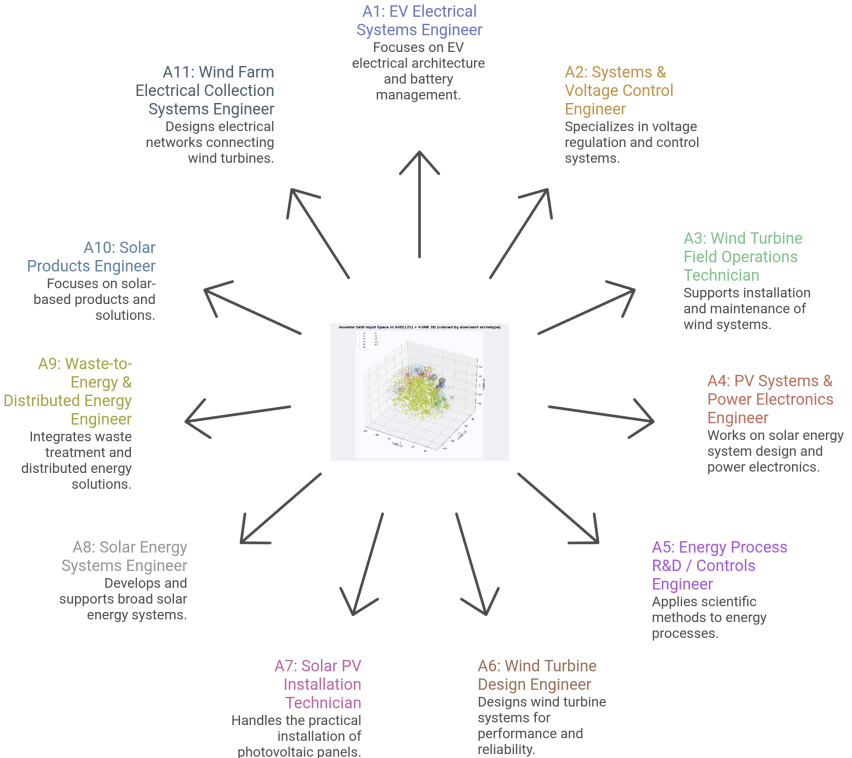
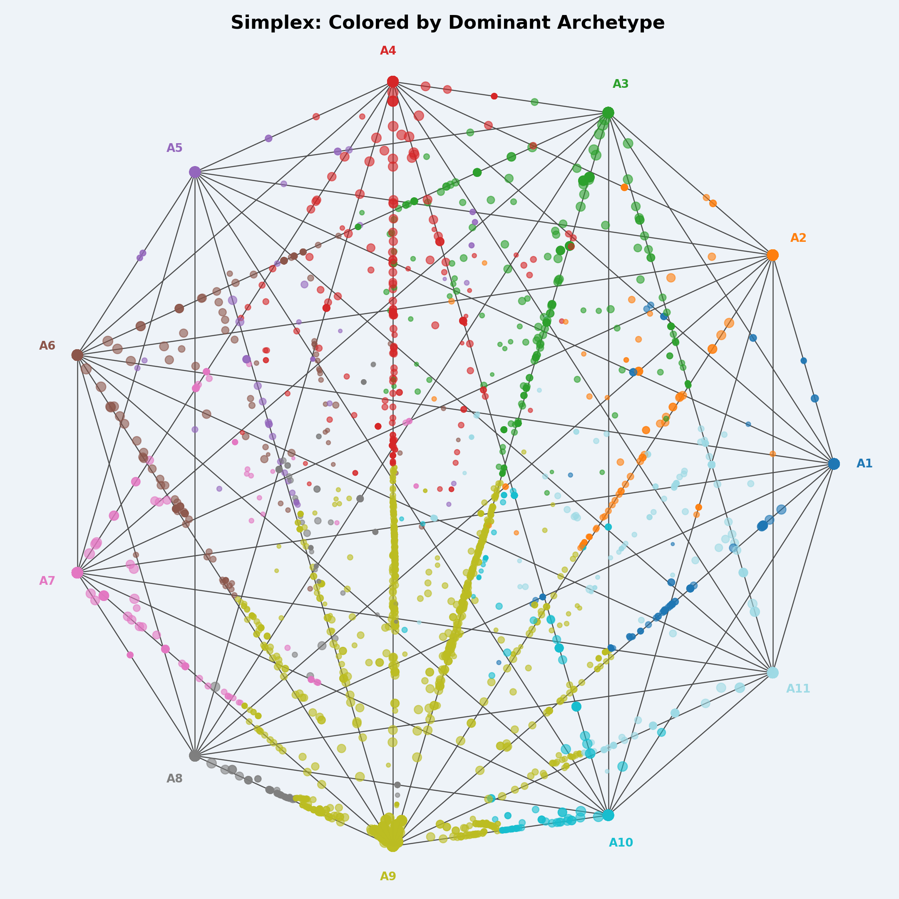
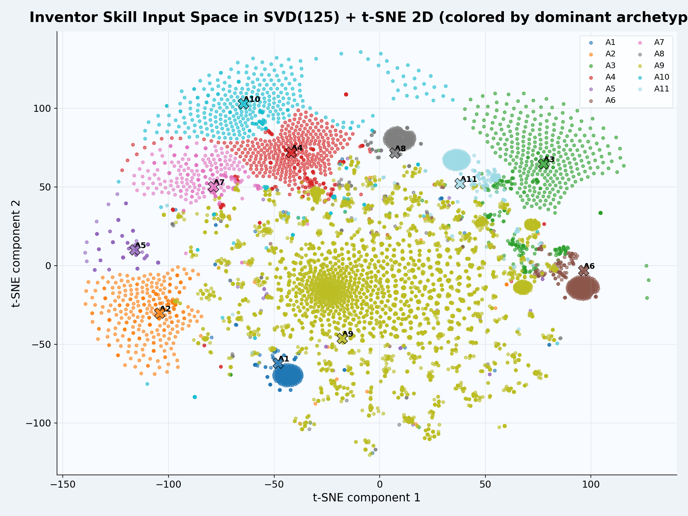

# The I-Files

**Formulating Patent Inventor Skill Profiles via Granted Patent Records**

An end-to-end, deterministic pipeline that turns raw green-technology patent text into
interpretable, inventor-level skill profiles. Patents are filtered with LLMs, mapped to
normalized [ESCO](https://esco.ec.europa.eu/) skills, aggregated per inventor, and decomposed
into explainable *archetypes* via Archetypal Analysis.

> School of Informatics, Aristotle University of Thessaloniki

---

## What it does

Patent documents describe *inventions*, not the *skills* of the people behind them. This project
asks whether granted patent records can be used to build inventor-level skill profiles, and
whether those profiles break down into a small set of explainable roles ("archetypes").

The pipeline:

1. **Retrieve** ~48,000 candidate green patents from [The Lens](https://www.lens.org/) (2017+) using CPC/IPC codes + green keywords.
2. **Filter** them to real green patents with a two-stage LLM ensemble (local hard-voting + cloud verification).
3. **Deduplicate** records deterministically.
4. **Extract skills** from each patent's title + abstract with the [ESCO Skill Extractor](https://github.com/nikifori/esco-skill-extractor) (included as a submodule), mapping text to normalized ESCO skill labels.
5. **Aggregate** patent-level skills into an inventor × skill matrix.
6. **Profile** inventors with Archetypal Analysis to surface extreme, interpretable skill roles.



## Why Archetypal Analysis (not clustering)?

Clustering forces every inventor into a single group. Archetypal Analysis instead finds *extreme*
profiles (the "pure" roles) and describes each inventor as a **convex mixture** of them
(`X ≈ AZ`, weights summing to 1). An inventor can be 70% solar / 30% battery rather than just "solar".
This keeps the result both flexible and explainable, since each archetype lives in the original
skill space and can be read off directly from its top ESCO skills.



## Key results

The final corpus and matrix:

| Quantity | Value |
|---|---|
| Green patents (after filtering + dedup) | 8,381 |
| Unique inventors | 15,667 |
| Distinct ESCO skills | 1,237 |
| Matrix sparsity | ~99.4% zeros |
| Selected archetypes (Kneedle elbow) | **11** |
| Best inventor representation | **TF-IDF** |

Four inventor/skill representations were compared (Hard, Hard-log1p, Soft, Binary-Hard, TF-IDF).
**TF-IDF won overall**: high membership purity (0.92), a moderate largest-archetype share (0.64),
and the lowest cross-archetype overlap (max off-diagonal cosine ≈ 0.04), giving the cleanest,
most distinguishable roles.

### The 11 inventor archetypes



| # | Role | Defining skills |
|---|---|---|
| A1 | EV Electrical Systems Engineer | vehicle electrical systems; battery management |
| A2 | Systems & Voltage Control Engineer | systems theory; adjust voltage; alternative fuels |
| A3 | Wind Turbine Field Operations Technician | install/maintain onshore wind systems |
| A4 | PV Systems & Power Electronics Engineer | photovoltaic systems; power electronics |
| A5 | Energy Process R&D / Controls Engineer | scientific methods; gas processing; control systems |
| A6 | Wind Turbine Design Engineer | design/maintain wind turbines |
| A7 | Solar PV Installation Technician | mount PV panels; panel mounting systems |
| A8 | Solar Energy Systems Engineer | solar energy; concentrated solar power |
| A9 | Waste-to-Energy & Distributed Energy Engineer | thermal treatment; biogas; energy efficiency *(broadest)* |
| A10 | Solar Products Engineer | solar products; photovoltaic systems |
| A11 | Wind Farm Electrical Collection Systems Engineer | wind farm collector design |

Most inventors map strongly to a single archetype (median purity ≈ 0.98), with one broad
"generalist" archetype (A9) dominating ~64% of inventors and the rest forming sharper specialties.

<p align="center">
  
  
</p>

## Tech stack

- **LLM filtering:** Ollama (Llama 3.1 8B, Qwen 2.5 7B, Mistral) + OpenAI Batch API (GPT-5.4 nano)
- **Skill extraction:** ESCOX / Sentence-BERT (`all-MiniLM-L6-v2`), ESCO taxonomy
- **Analysis:** `archetypes`, scikit-learn (SVD, t-SNE), scipy, pandas, matplotlib

## Repository structure

```
patent-inventor-profiler/
├── src/
│   ├── green_patents_filtering_llms/
│   │   ├── llms_filtering.py            # Stage 1: local Ollama ensemble + hard voting
│   │   ├── cloud_based_llm_filtering.py # Stage 2: OpenAI Batch API (GPT) verification
│   │   ├── post_processing.py           # deterministic deduplication
│   │   └── filtering_stats.py           # filtering / agreement statistics
│   ├── piprofiling_v0/                  # main profiling pipeline
│   │   ├── pipeline.py                  # entry point
│   │   ├── pipeline_utils.py
│   │   ├── utils.py
│   │   └── configs/piprofiling.yaml     # all pipeline parameters
│   └── analysis/
│       ├── patent_skills_eda.py
│       ├── inventor_skills_eda.py
│       └── archetypes_optical_analysis.py  # t-SNE, simplex & dominant-archetype plots
├── resources/
│   └── ESCO_link2skill_mapping.csv      # ESCO URI → human-readable skill label lookup
├── esco-skill-extractor/                # git submodule (skill extractor)
├── data/test/                           # small sample inputs (Lens export template)
├── requirements.txt
└── README.md
```

> The full patent CSVs are not shipped in the repo (they are produced by the filtering stages from a Lens export). The Lens search query and LLM prompt are in the paper's appendices. `data/test/` holds a 10-row template for a quick dry run.

## Getting started

### Install

```bash
# clone with the skill-extractor submodule
git clone --recurse-submodules https://github.com/nikifori/patent-inventor-profiler.git
cd patent-inventor-profiler
# (if you already cloned without submodules: git submodule update --init)

pip install -r requirements.txt   # installs the submodule in editable mode too
```

### Run the main profiling pipeline

This is the core step (skill extraction → inventor matrix → archetypal analysis). All behaviour is
driven by the YAML config:

```bash
python src/piprofiling_v0/pipeline.py \
  --config ./src/piprofiling_v0/configs/piprofiling.yaml
```

Key settings in `configs/piprofiling.yaml`:

| Parameter | Purpose |
|---|---|
| `data_csv_path` | input patent CSV (a Lens-style export) |
| `inventor_vector_type` | representation: `hard` / `soft` / `tfidf` / `binary-hard` — **set to `tfidf` to reproduce the main experiment** |
| `model_skill_threshold` | ESCOX cosine threshold (default `0.6`) |
| `num_archetypes` | `-1` = auto-select via Kneedle elbow, or a fixed `k` |
| `max_k`, `n_init`, `random_seed` | archetype search range (2–30), restarts (10), seed (42) |
| `device` / `backend` | `cuda`/`cpu`; archetype backend `torch`/`jax`/`numpy` |
| `output_dir` | where the run's matrices, memberships and reports are written |

### Build the green-patent corpus (optional, to regenerate data)

These run on a raw Lens export and reproduce the filtering pipeline:

```bash
# Stage 1 — local LLM ensemble (needs Ollama running on :11434)
python src/green_patents_filtering_llms/llms_filtering.py
# Stage 2 — cloud verification (needs OPENAI_API_KEY)
python src/green_patents_filtering_llms/cloud_based_llm_filtering.py
# Deduplicate
python src/green_patents_filtering_llms/post_processing.py
```

> **Note:** the three filtering scripts use hardcoded input/output paths defined at the top of each
> file, and `cloud_based_llm_filtering.py` is driven by an `ACTION` variable
> (`PREPARE → SUBMIT_ALL → STATUS_ALL → COLLECT_ALL`). Edit those constants to match your machine
> before running. Stage 1 also expects the Ollama models pulled locally:
> ```bash
> ollama pull llama3.1:8b-instruct-q8_0 qwen2.5:7b-instruct mistral:instruct
> export OPENAI_API_KEY=sk-...
> ```

### Reproduce the figures

```bash
python src/analysis/archetypes_optical_analysis.py --base_dir <output_dir_of_a_run>
python src/analysis/patent_skills_eda.py     --input_csv <run>/patent_X_skills.csv
python src/analysis/inventor_skills_eda.py   --input_csv <run>/patent_X_inventor_skills.csv
```

> `archetypes_optical_analysis.py` also imports `umap`, which isn't pinned in `requirements.txt` —
> `pip install umap-learn` if you want the UMAP projections.

## Reproducibility

The pipeline is deterministic: fixed seed (42), NNLS archetype optimization with 10 restarts,
conservative LLM decoding (temperature 0.1), and saved snapshots/reports at each preprocessing
step. Skill extraction uses the GPU when available; the Archetypal Analysis backend is selectable
(`torch` / `jax` / `numpy`) via the config.

## Citation

```bibtex
@article{nikiforidis_patent_inventor_profiler,
  title  = {The I-Files: Formulating Patent Inventor Skill Profiles via Granted Patent Records},
  author = {Nikiforidis, Konstantinos and Georgiou, Konstantinos and
            Kavargyris, Dimitrios Christos and Angelis, Lefteris},
  school = {Aristotle University of Thessaloniki, School of Informatics},
  year   = {2026}
}
```

## Authors

Konstantinos Nikiforidis · Konstantinos Georgiou · Dimitrios Christos Kavargyris ·
Lefteris Angelis (supervisor)
